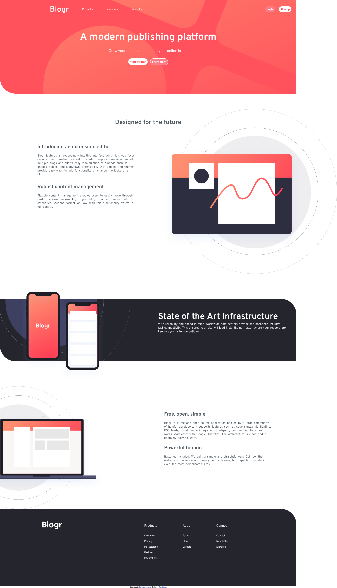
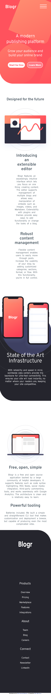

# Frontend Mentor - Blogr landing page solution

This is a solution to the [Blogr landing page challenge on Frontend Mentor](https://www.frontendmentor.io/challenges/blogr-landing-page-EX2RLAApP). Frontend Mentor challenges help you improve your coding skills by building realistic projects. 

## Table of contents

- [Overview](#overview)
  - [The challenge](#the-challenge)
  - [Screenshot](#screenshot)
  - [Links](#links)
- [My process](#my-process)
  - [Built with](#built-with)
  - [What I learned](#what-i-learned)
  - [Continued development](#continued-development)
  - [Useful resources](#useful-resources)
- [Author](#author)
- [Acknowledgments](#acknowledgments)

**Note: Delete this note and update the table of contents based on what sections you keep.**

## Overview

### The challenge

Users should be able to:

- View the optimal layout for the site depending on their device's screen size
- See hover states for all interactive elements on the page

### Screenshot





### Links

- Solution URL: https://github.com/Rk44-github/Blogr-website.git
- Live Site URL: https://rk44-github.github.io/Blogr-website/

## My process

### Built with

- Semantic HTML5 markup
- CSS custom properties
- Flexbox
- CSS Grid
- Desktop-first work-flow

**Note: These are just examples. Delete this note and replace the list above with your own choices**

### What I learned

I used this simple method for toggling between the class for nav


```js
$(document).ready(function(){
       
   const navBar = $('.nav-list');
   const nav = 
        
       $('.burger').click( ()=> {
         
                   navBar.toggleClass("reveal");
       })
  

});
}
```

If you want more help with writing markdown, we'd recommend checking out [The Markdown Guide](https://www.markdownguide.org/) to learn more.


### Continued development
I would like focus on mobile navigaton more, and also would to add more interactivity to the website.


## Author

- Website - [Raj Kumar](https://www.your-site.com)
- Frontend Mentor - [Rk44-github](https://www.frontendmentor.io/Rk44-github)
- Twitter - [Rk44-github]

**Note: Delete this note and add/remove/edit lines above based on what links you'd like to share.**

## Acknowledgments

-I took help from google, that too for taking reference for certain tags and jquery elements.
-rest I completed the challange of my own.

**Note: Delete this note and edit this section's content as necessary. If you completed this challenge by yourself, feel free to delete this section entirely.**
